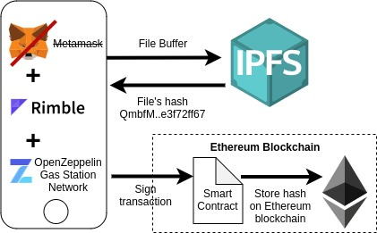

# ipfs-upload-dapp
Uploads file to IPFS and stores corresponding hash on Ethereum

## Architecture

## Getting started

### Development
1. Start local blockchain network: `ganache-cli --deterministic`
2. Create contract instance: `oz create`
3. Don't forget to initialize GSNRecipient contract: `oz send-tx`, `initalize()`

## Resources
Based on this [tutorial](https://www.freecodecamp.org/news/hands-on-get-started-with-infura-and-ipfs-on-ethereum-b63635142af0/)
with the following improvements/changes:
- Add tests
- Use [Gas Station Network](https://gsn.openzeppelin.com/) to turn dapp into app
- Use rimble UI for front end styling
- Use ethers.js instead of web3.js

### Tech stack
- [Openzeppelin GSN Starter Kit](https://docs.openzeppelin.com/starter-kits/2.3/gsnkit)
- [React](https://reactjs.org/)
- [Rimble UI](https://rimble.consensys.design/)
- [Infura](https://infura.io/): Ethereum|IPFS API & Gateway
- [ethers.js](https://github.com/ethers-io/ethers.js/): Complete Ethereum wallet implementation and utilities in JavaScript
